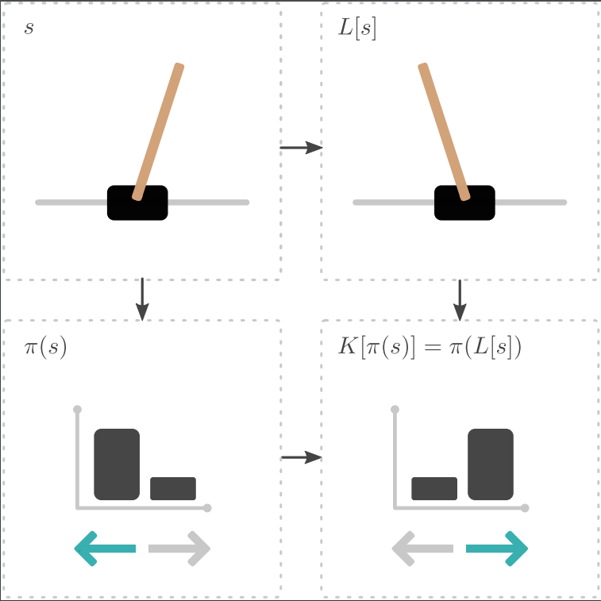

# MDP Homomorphic Networks: Group Symmetries in Reinforcement Learning

Symmetrizer code accompanying the paper:

**MDP Homomorphic Networks: Group Symmetries in Reinforcement Learning**  
Elise van der Pol, Daniel E. Worrall, Herke van Hoof, Frans A. Oliehoek, Max Welling.  

https://arxiv.org/pdf/2006.16908.pdf 



**Abstract:** 
This paper introduces MDP homomorphic networks for deep reinforcement learning.
MDP homomorphic networks are neural networks that are equivariant under
symmetries in the joint state-action space of an MDP. Current approaches to deep
reinforcement learning do not usually exploit knowledge about such structure. By
building this prior knowledge into policy and value networks using an equivariance
constraint, we can reduce the size of the solution space. We specifically focus
on group-structured symmetries (invertible transformations). Additionally, we
introduce an easy method for constructing equivariant network layers numerically,
so the system designer need not solve the constraints by hand, as is typically done.
We construct MDP homomorphic MLPs and CNNs that are equivariant under either
a group of reflections or rotations. We show that such networks converge faster
than unstructured baselines on CartPole, a grid world and Pong.


## Installation
* ```conda env create -f environment.yml```
* ```pip install gym==0.17```
* ```pip install -e .```

See if it works:
* ```./tests.sh```

### Cite
If you use this code in your own work, please cite our paper:
```
@inproceedings{vanderpol2020mdp,
  title={{MDP} Homomorphic Networks: Group Symmetries in Reinforcement Learning},
  author={van der Pol, Elise and Worrall, Daniel E. and van Hoof, Herke, and Oliehoek, Frans A. and Welling, Max},
  booktitle={Advances in Neural Information Processing Systems},
  year={2020}
}

```

The Robert Bosch GmbH is acknowledged for financial support.
